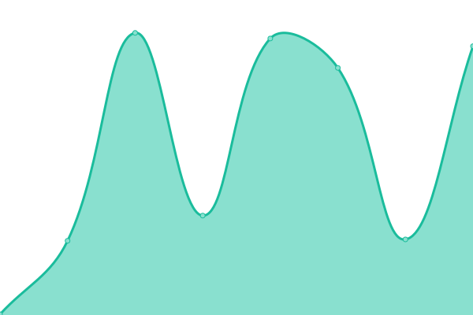

# [📈 Live Status](https://mefengl.github.io/my-upptime): <!--live status--> **🟧 Partial outage**

This repository contains the open-source uptime monitor and status page for [冯不游](https://mefengl.github.io/my-upptime), powered by [Upptime](https://github.com/upptime/upptime).

With [Upptime](https://upptime.js.org), you can get your own unlimited and free uptime monitor and status page, powered entirely by a GitHub repository. We use [Issues](https://github.com/mefengl/my-upptime/issues) as incident reports, [Actions](https://github.com/mefengl/my-upptime/actions) as uptime monitors, and [Pages](https://mefengl.github.io/my-upptime) for the status page.

<!--start: status pages-->
<!-- This summary is generated by Upptime (https://github.com/upptime/upptime) -->
<!-- Do not edit this manually, your changes will be overwritten -->
<!-- prettier-ignore -->
| URL | Status | History | Response Time | Uptime |
| --- | ------ | ------- | ------------- | ------ |
|  [OpenAI Chat](https://chat.openai.com) | 🟥 Down | [open-ai-chat.yml](https://github.com/mefengl/my-upptime/commits/HEAD/history/open-ai-chat.yml) | 

 55ms
     
 | 

<a href="https://mefengl.github.io/my-upptime/history/open-ai-chat">0.06%</a>
    

|  [mefengl Blog](https://mefengl.me/blog) | 🟩 Up | [mefengl-blog.yml](https://github.com/mefengl/my-upptime/commits/HEAD/history/mefengl-blog.yml) | 

 229ms
     
 | 

<a href="https://mefengl.github.io/my-upptime/history/mefengl-blog">1.10%</a>
    

|  [Hacker News](https://news.ycombinator.com) | 🟩 Up | [hacker-news.yml](https://github.com/mefengl/my-upptime/commits/HEAD/history/hacker-news.yml) | 

 328ms
     
 | 

<a href="https://mefengl.github.io/my-upptime/history/hacker-news">100.00%</a>
    

<!--end: status pages-->

[**Visit our status website →**](https://mefengl.github.io/my-upptime)

## 📄 License

- Powered by: [Upptime](https://github.com/upptime/upptime)
- Code: [MIT](./LICENSE) © [冯不游](https://mefengl.github.io/my-upptime)
- Data in the `./history` directory: [Open Database License](https://opendatacommons.org/licenses/odbl/1-0/)
